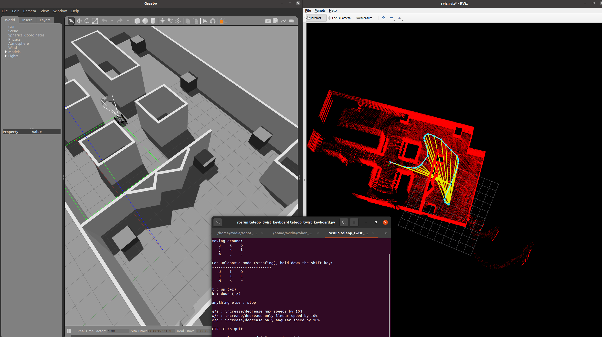

## 基于Gazabo的slam仿真环境
> 基于Ubuntu20.04与ROS noetic创建
----------
### 包含的基本功能
* [基于velodyne雷达sdk与gazebo的车辆模型与仿真环境](https://github.com/linzs-online/robot_gazebo/tree/main)
* [基于Lio-sam算法的三维建图](https://github.com/TixiaoShan/LIO-SAM/tree/master)
* [三维激光雷达to二维激光雷达的数据格式转换](https://github.com/zhouyong1234/pointcloud_to_laserscan)
* 基于gmapping、ACML、Move_base三件套的二维激光slam与导航
-------
### 必要前置
* Lio-sam_main
```
  sudo apt-get install -y ros-noetic-navigation
  sudo apt-get install -y ros-noetic-robot-localization
  sudo apt-get install -y ros-noetic-robot-state-publisher
```
- [gtsam](https://gtsam.org/get_started/) (Georgia Tech Smoothing and Mapping library)
```
  sudo add-apt-repository ppa:borglab/gtsam-release-4.1
  sudo apt install libgtsam-dev libgtsam-unstable-dev
```
* environment
```
  sudo apt-get install libeigen3-dev
  sudo apt install libpcl-dev
  sudo apt install ros-noetic-teleop-twist-keyboard
```
* navigation
```
  sudo apt install ros-noetic-gmapping
  sudo apt install ros-noetic-map-server
  sudo apt install ros-noetic-navigation
```
* 其他
```
  安装时可能还会提示缺少其他包，如serial等；像这种情况按error提示安装即可
```
---------
### 功能包说明与本项目基于原项目的修改
#### velodyne_simulator
* **功能：velodyne三维激光雷达所需的必要工具包**
#### scout_gazebo
* **功能：仿真场景与机器人创建**
* 改动1：删去了机器人的摄像头及其对应的必要工具包
* 改动2：将机器人的base_footprint与base_link进行了适当的坐标变换，并以footprint为后续基本坐标系，修正了机器人在rviz中z坐标不正常导致陷入地下的问题
* 改动3：在launch文件中使robot_state_publisher节点不显示GUI
#### lio_sam
* **功能：三维激光点云建图**
* 改动1：做了版本迁移至noetic的必要修改，见[作者说明链接](https://github.com/TixiaoShan/LIO-SAM/issues/206#issuecomment-1095370894)；其中，gtsam已经不支持4.0.3版本，请按照前述前置安装4.1版本
#### pointcloud_to_laserscan
* **功能：三维激光雷达pointcloud数据格式转换为二维激光雷达scan格式**
* 改动1：按照雷达型号与遇到的仿真问题重新编写了启动launch文件
#### self_navigation
* **功能：二维栅格地图的导航实现**
*  修改太多，基本流程可见[autolabor的ros教程](http://www.autolabor.com.cn/book/ROSTutorials/di-7-zhang-ji-qi-ren-dao-822a28-fang-771f29/72-dao-hang-shi-xian.html),具体修改见后文
----------
### 功能启动指令与效果演示
#### 三维建图流程及效果演示
* 启动gazebo环境与机器人
```
 roslaunch scout_gazebo scout_gazebo.launch
```
* 启动liosam三维建图
```
 roslaunch lio_sam run.launch
```
* 启动建图时的手动控制行动节点
```
 $ rosrun teleop_twist_keyboard teleop_twist_keyboard.py
```
* 效果演示

#### 二维建图流程及效果演示
* 启动gazebo环境与机器人
```
 roslaunch scout_gazebo scout_gazebo.launch
```
* 启动点云转scan节点
```
 roslaunch pointcloud_to_laserscan run.launch
```
* 启动gmapping建图并保存到self_navigation/map
```
 rosrun gmapping slam_gmapping
 # 在环境走完一圈，地图基本完整以后再保存
 roslaunch self_navigation load.launch
```
* 启动导航总launch文件
```
 roslaunch self_navigation final.launch
```
> 说明：此launch文件启动了地图加载节点、acml车辆定位节点与movebase车辆导航控制节点
* 效果演示
  


-----------------------
### 调试遇到的问题及解决方式
* gazebo未正常关闭后下一次启动节点时不能正常启动
> 使用 *killall gzserver* 指令杀死gazebo未正常关闭的进程后即可正常关闭
* 车辆在rviz中显示不正常，下半部分沉到地下
> 将机器人的base_footprint与base_link进行了适当的坐标变换，并以footprint为后续基本坐标系
* liosam功能包不能正常编译
> 需要进行版本迁移至noetic的必要修改，见[作者说明链接](https://github.com/TixiaoShan/LIO-SAM/issues/206#issuecomment-1095370894)
* liosam出现极大的偏移与跳动
> **gazebo的IMU插件本身就有问题，它可能在机器人未移动时突然产生一个极短时间极大幅值的角加速度脉冲**；liosam对这种瞬时误差敏感，经过累计就会造成漂移。在实际的IMU上这种脉冲情况则会好很多，故liosam实际上对gazebo仿真的效果并不好；本人尝试使用对IMU数据进行滤波来解决，但经过滤波后IMU数据世界戳会与雷达点云时间戳对不上，也会积累误差，仍旧发生漂移，仅仅是跳动会略微好一点
* 经过二维化的scan数据传给gmapping时其出现“段错误”
> gamapping对雷达scan数据的分辨率有要求，如果分辨率太高则会爆内存；在pointcloud_to_laserscan的run.launch文件中有一个参数angle_increament，这个值设置越小精度越高，故此处可以适当的增大此参数满足gmapping需要
* movebase导航时无法应对新出现的障碍物进行避障
> 在self_navigation的param文件夹中检查costmap_common_params.yaml的scan-sensor_frame名字是否设置对了,要是自己雷达的坐标系的名字；另外记得检查这些yaml文件中各种坐标系的名字和自己的名字是否对应
* *（以上问题均已进行修复）*
-----------------
### 附录
#### 二维slam导航流程分析
1. 首先需要根据二维雷达的scan数据进行建图；gmapping根据收到的信息建出pgm格式的静态栅格全局地图并保存
2. 在进行导航时：需要加载保存的全局地图；ACML包根据雷达扫描到的信息与全局地图进行匹配，找出车辆目前在全局地图中的位置
3. move_base包进行路径规划；此功能包可以更新车辆周围一段范围内的环境作为局部地图，防止建完图后环境中出现新的障碍物，起到了避障的效果；另外，move_base的全局路径规划与局部路径规划有很多可选方法与可调参数，仔细调调可以明显优化导航效果
#### 可以参考的资料
* [autolabor的二维slam仿真教程](http://www.autolabor.com.cn/book/ROSTutorials/di-7-zhang-ji-qi-ren-dao-822a28-fang-771f29/72-dao-hang-shi-xian.html)
* [gmapping解析](https://zhuanlan.zhihu.com/p/262287388)
* [ACML原理解析](https://zhuanlan.zhihu.com/p/296615490)
* [move_base参数配置详解](https://blog.csdn.net/weixin_43259286/article/details/107235533)

